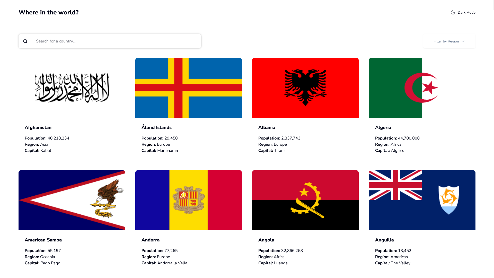

# Frontend Mentor - REST Countries API with color theme switcher solution

This is a solution to the [REST Countries API](https://www.frontendmentor.io/challenges/rest-countries-api-with-color-theme-switcher-5cacc469fec04111f7b848ca) challenge on Frontend Mentor.

## Table of contents

- [Overview](#overview)
  - [The challenge](#the-challenge)
  - [Screenshot](#screenshot)
  - [Links](#links)
- [My process](#my-process)
  - [Built with](#built-with)
- [Author](#author)

## Overview

### The challenge

Users should be able to:

- See all countries from the API on the homepage
- Search for a country using an `input` field
- Filter countries by region
- Click on a country to see more detailed information on a separate page
- Click through to the border countries on the detail page
- Toggle the color scheme between light and dark mode

### Screenshot

### Links

- Live Site URL: [Click here](https://rest-countries-six-omega.vercel.app/)

## My process

### Built with

- **[React](https://reactjs.org/)**
- **[Vite](https://vitejs.dev/)**
- **[TypeScript](https://www.typescriptlang.org/)** 
- **[React Router](https://reactrouter.com/)**
- **[Tailwind CSS](https://tailwindcss.com/)**
- **[Radix UI (Select)](https://www.radix-ui.com/)** 
- **[REST Countries API](https://restcountries.com/)**
- Mobile-first
- CSS Custom Properties

## Author

- Frontend Mentor - [@Maldak123](https://www.frontendmentor.io/profile/Maldak123)
